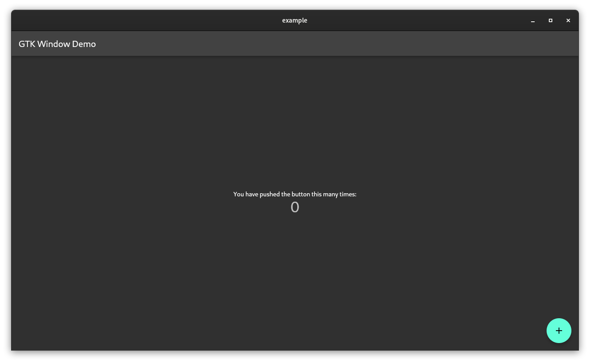
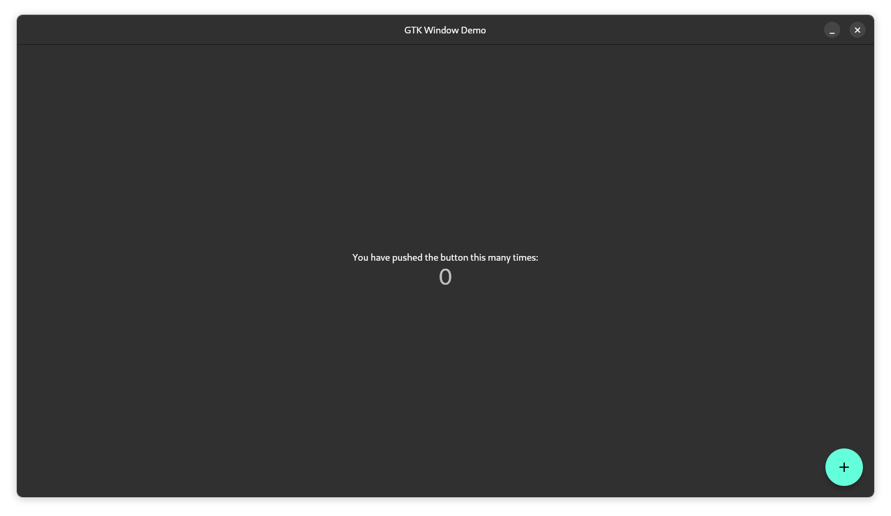

<!--
This README describes the package. If you publish this package to pub.dev,
this README's contents appear on the landing page for your package.

For information about how to write a good package README, see the guide for
[writing package pages](https://dart.dev/guides/libraries/writing-package-pages).

For general information about developing packages, see the Dart guide for
[creating packages](https://dart.dev/guides/libraries/create-library-packages)
and the Flutter guide for
[developing packages and plugins](https://flutter.dev/developing-packages).
-->

A package that add some missing gtk4 windowing features to flutter. Works for linux but it can also work for MacOS and Windows.   
Before:   

After:   


## Features

 - HeaderBar
    - Window Command buttons like Maximize, Minimize, and Close   
    
    - Back button when there's a view that can be poped
    
    - Light and Dark mode

## Getting started

To get started on linux:
Edit the linux/my_application.cc file as the following

We first need to remove the native title_bar. So just comment out the code below
```cc
//gboolean use_header_bar = TRUE;
// #ifdef GDK_WINDOWING_X11
//   GdkScreen* screen = gtk_window_get_screen(window);
//   if (GDK_IS_X11_SCREEN(screen)) {
//     const gchar* wm_name = gdk_x11_screen_get_window_manager_name(screen);
//     if (g_strcmp0(wm_name, "GNOME Shell") != 0) {
//       use_header_bar = FALSE;
//     }
//   }
// #endif
//   if (use_header_bar) {
//     GtkHeaderBar* header_bar = GTK_HEADER_BAR(gtk_header_bar_new());
//     gtk_widget_show(GTK_WIDGET(header_bar));
//     gtk_header_bar_set_title(header_bar, "example");
//     gtk_header_bar_set_show_close_button(header_bar, TRUE);
//     gtk_window_set_titlebar(window, GTK_WIDGET(header_bar));
//   } else {
//     gtk_window_set_title(window, "example");
//   }
```

Then move the two lines to the end of the my_application_activate class
from:
```cc
gtk_window_set_default_size(window, 1280, 720);
//gtk_widget_show(GTK_WIDGET(window));
```
```cc
FlView* view = fl_view_new(project);
//gtk_widget_show(GTK_WIDGET(view));
gtk_container_add(GTK_CONTAINER(window), GTK_WIDGET(view));
```

to:
```cc
static void my_application_activate(GApplication* application) {
...

gtk_widget_show(GTK_WIDGET(window));
gtk_widget_show(GTK_WIDGET(view));
}
```
## Usage

```dart
import 'package:gtk_window/gtk_window.dart';
Scaffold(
    appBar: GTKHeaderBar
        title: Text('example title'),
      ),
)
```

## Current limitations
 - The OS doesn't treat the appbar natively so it can't be hidden in the case of using a window manager.
## Why not just use the native headerbar provided by flutter?
Due to the wide array of supported platforms that the flutter team mantain, they have to bundle features together to work on as much platforms as they can to simplify development. So they made the GTK appbar version to be just like MacOS's and Windows' as they just hover over the content without having so muchcontrol over them. In GTK the appbar's can have lots of widgets contained in them, which without this package you would have no control over them.

## Disclaimer
I not very profecient with GTK itself and every suggestion is welcome.

## Used plugins
I actually didn't write any platform specific codes for this package. I relied on the amazing work done by handy_window and window_manager maintainers.